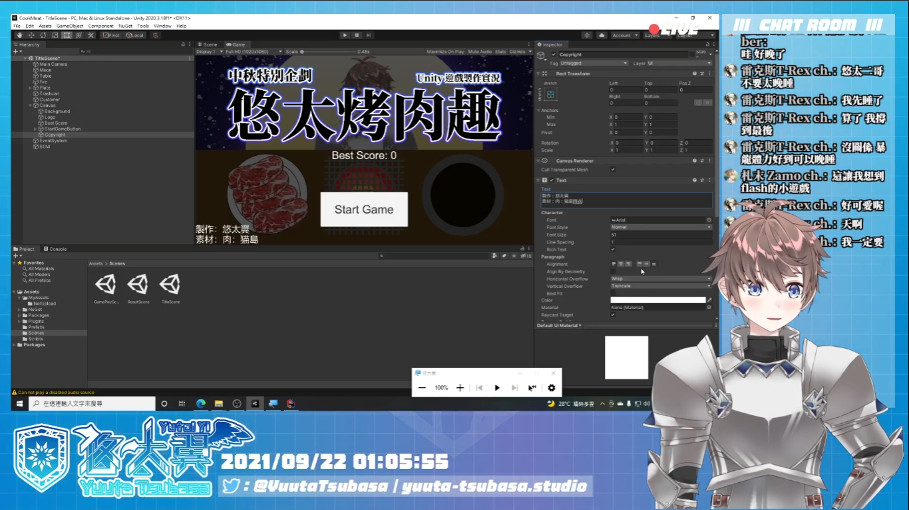

# 中秋特別企劃－Unity 遊戲製作實況：悠太烤肉趣

一個在中秋節於[實況](http://yutaii.run/live/22)中製作出來的烤肉小遊戲。

## 遊玩方式
進入[網頁](http://yuuta-tsubasa.studio/CookMeat/)即可遊玩。

## 專案說明

### 使用 Unity 版本
2020.3.18f1

### 使用外掛技術
- [UniTask](https://github.com/Cysharp/UniTask)
- [UniRx](https://github.com/neuecc/UniRx)
- [NuGetForUnity](https://github.com/GlitchEnzo/NuGetForUnity)
- [language-ext](https://github.com/louthy/language-ext)
- [Unity auto attach component via attributes](https://github.com/Nrjwolf/unity-auto-attach-component-attributes)

### 素材提供
- 肉：[猫島羽依老師](https://twitter.com/NekosimaYui)
- 烤肉音效：[Freesound](https://freesound.org/)
- 背景音樂與音效：[魔王魂](https://maou.audio/)
- 字體：[Noto Sans](https://fonts.google.com/noto/specimen/Noto+Sans+TC)

## 作者
- [悠太翼 @YuutaTsubasa](http://yutaii.run/twitter)
- 歡迎訂閱我的 [Youtube 頻道](http://yutaii.run/youtube)！
- 有任何想要修改的部分歡迎發 Pull Request、發 Issue 或是私訊唷！